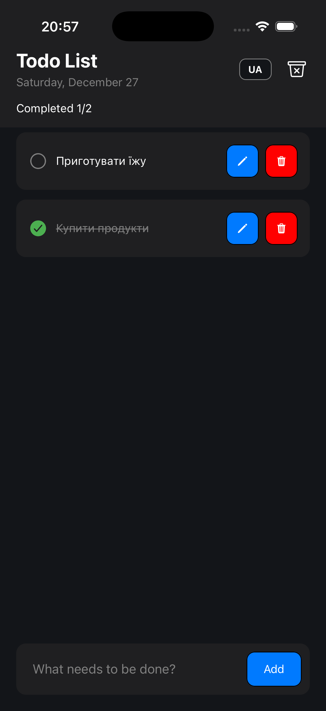
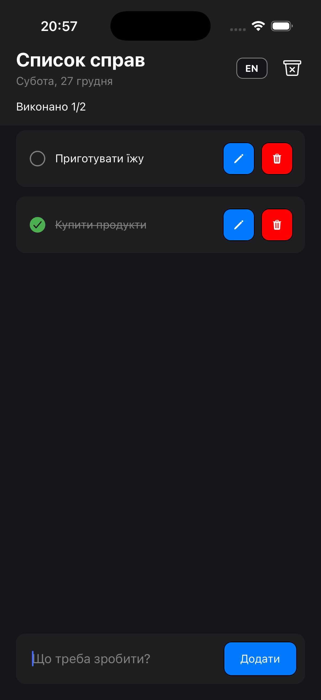
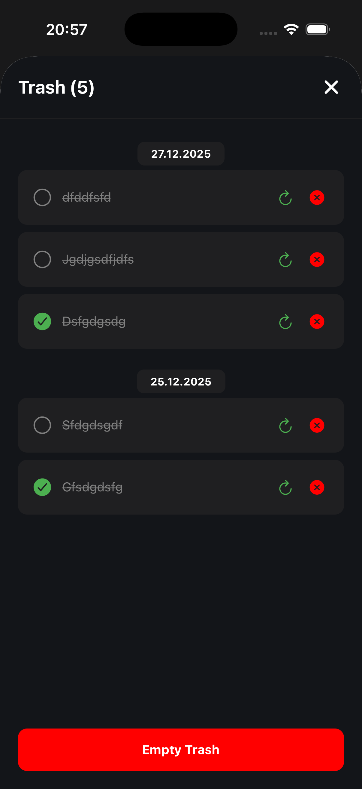
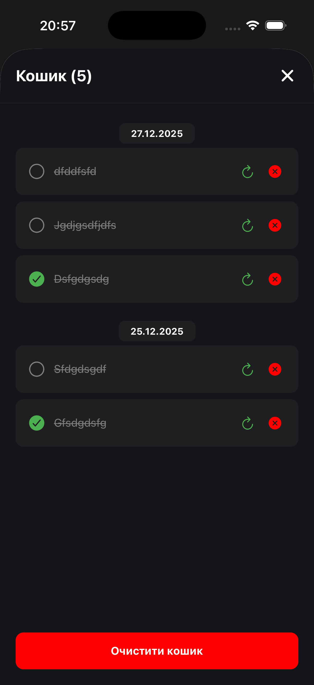

# 📱 React Native Todo App


Modern mobile application for task management with "Trash Bin" (Soft Delete) and data saving on the device.

<p align="center">




  </p>

## ✨ Functionality

* **Create/Read/Update/Delete (CRUD):** Full cycle of task management.
* **Saving data:** Tasks are saved in phone memory (AsyncStorage) and do not disappear after a restart.
* **Trash Bin:** Deleted tasks do not disappear immediately, but are moved to the Trash Bin with grouping by the date of deletion.
* **Restoring:** Ability to restore a task from the Trash Bin or delete it permanently.
* **Animations and UI:** Custom modals, smooth transitions, and a dark interface.

## 🛠 Technical Stack

* **Framework:** React Native (Expo SDK 52)
* **Language:** TypeScript
* **Routing:** Expo Router (File-based routing)
* **State Management:** Zustand (with middleware `persist` for caching)
* **Storage:** React Native Async Storage
* **Icons:** Ionicons (@expo/vector-icons)

## 🚀 How to run the project

1.  **Clone the repository:**
    ```bash
    git clone https://github.com/livadin/TodoApp.git
    cd TodoApp
    ```

2.  **Install dependencies:**
    ```bash
    npm install
    ```

3.  **Run the project:**
    ```bash
    npx expo start
    ```

4.  **Open the app:**
    * Download **Expo Go** on your phone (iOS/Android).
    * Scan the QR code from the terminal.

## 📂 Project structure

```text
app/              # Expo Router (screens)
components/       # Reusable UI components (buttons, checkboxes, modals)
layout/           # Large interface blocks (Header, TodoList)
store/            # Zustand store (data logic)
constants/        # Constants (colors, settings)
types/            # TypeScript interfaces
```

## 👤 Author
1.  **GitHub: [livadin](https://github.com/livadin)**

2.  **LinkedIn: [Danylo Vilchauskas](https://www.linkedin.com/in/danylo-vilchauskas-64019530a/)**